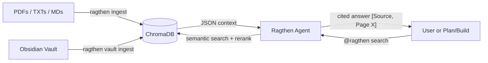
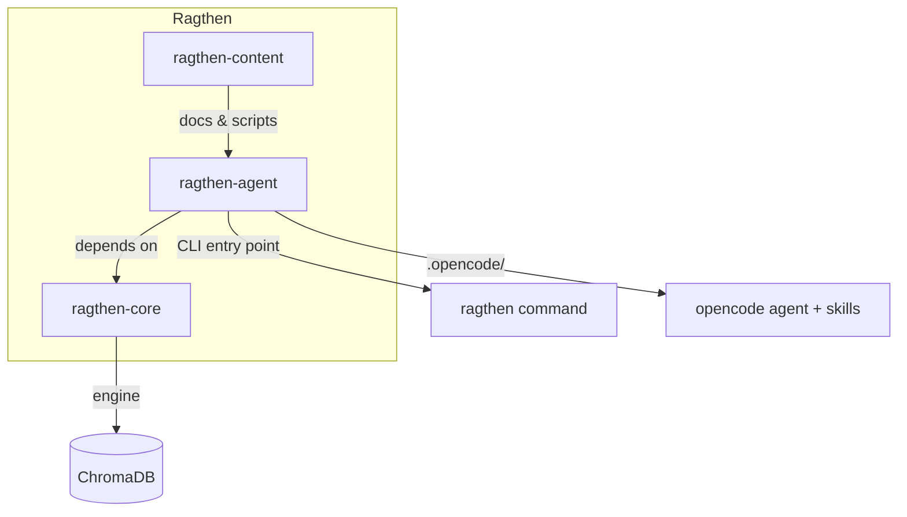
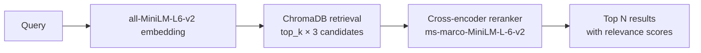
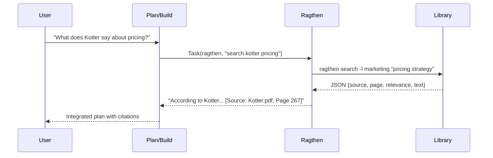

# Ragthen

**Library-first RAG agent for opencode.** Index PDFs, text files, and Obsidian vault notes into queryable ChromaDB libraries. Ships as a `mode: all` agent — switch to it with Tab or invoke it from Plan/Build via `@ragthen`.



---

## Why Ragthen?

| Problem | Ragthen's solution |
|---------|-------------------|
| LLMs answer from training data, not your documents | Ragthen ONLY uses your indexed library. Zero external knowledge. |
| Agents mix "thinking" and "researching" in one prompt | Ragthen is a dedicated read-only researcher with clean SOC. |
| Citations are vague or nonexistent | Every claim gets `[Source: filename, Page X]`. |
| Low-relevance results get silently used | Ragthen warns you and offers interactive fallback. |
| Multiple libraries are painful to cross-reference | Cross-library search with clear source separation. |

---

## Monorepo Structure



| Package | Purpose |
|---------|---------|
| `ragthen-agent/` | CLI, backends (local/remote), opencode agent definition, skills |
| `ragthen-core/` | RAG engine: ChromaDB, embeddings, chunking, rerank, search |
| `ragthen-content/` | Library structure docs and sync scripts |

---

## Features

### Semantic Search with Reranking

Two-phase retrieval for quality above speed:



### Local-First, Remote-Ready

- **Local backend**: ChromaDB + sentence-transformers (no API calls, no network needed)
- **Remote backend**: offload to an API server (swap a config flag)

### Obsidian Vault Integration

```bash
ragthen vault ingest -l mylib --vault "/path/to/vault"
```

Scans all notes in the vault, copies them to the library, and indexes them — making your second brain searchable.

### OpenCode Agent (Mode: all)



Ragthen is `mode: all` — Tab-switchable as primary AND invocable as subagent. Permissions are locked down:

| Permission | Value | Why |
|-----------|-------|-----|
| `bash: "ragthen *"` | allow | All library ops via CLI |
| `read` | allow | Inspect library files |
| `edit` | deny | Ragthen researches, caller writes |
| `webfetch` / `websearch` | deny | Library-only knowledge |

### Interactive Fallback

When results are sparse or low-relevance, Ragthen doesn't guess — it asks:

- "Intentar con terminos mas amplios"
- "Ver el estado de la libreria"
- "Buscar en otra libreria"

### Cross-Library Analysis

```bash
ragthen search -l marketing "pricing" --rerank --top 10
ragthen search -l drones "pricing" --rerank --top 10
```

Results are synthesized with clear source separation and comparison tables.

### Analisis Multifuente (Skill)

Built-in skill for deep cross-source analysis. Executes N+1 targeted searches per source, builds an integrated model with ASCII diagrams, and generates a 7-section Obsidian note. Every claim backed by `[Source: file, Page X]`.

---

## Quick Start

```powershell
# 1. Clone and bootstrap
git clone https://github.com/BrunoEdPerezS/ragthen.git
cd Ragthen
.\ragthen-agent\bootstrap.ps1

# 2. Create a library and add PDFs
New-Item -ItemType Directory -Path "$env:USERPROFILE\.ragthen\libraries\myresearch"
# Copy your PDFs/TXTs/MDs into that folder

# 3. Index and search
ragthen ingest -l myresearch
ragthen search -l myresearch "your question" --rerank --top 10
```

For full setup including the opencode agent, see [INSTALL.md](INSTALL.md).

---

## Commands

| Command | Description |
|---------|-------------|
| `ragthen libraries` | List all libraries and index status |
| `ragthen search -l NAME "query" --rerank --top N` | Semantic search with cross-encoder rerank |
| `ragthen status -l NAME` | Show indexed documents and chunk count |
| `ragthen ingest -l NAME` | Index all PDFs/TXTs/MDs in a library |
| `ragthen clear -l NAME` | Delete the library index |
| `ragthen vault ingest -l NAME --vault PATH` | Index Obsidian vault notes |
| `ragthen config` | Show current configuration |
| `ragthen ask -l NAME "query"` | Full RAG via LLM (requires `OPENAI_API_KEY`) |

---

## Configuration

Edit `~/.ragthen/config.json`:

```json
{
  "backend_mode": "local",
  "vault_path": "/path/to/obsidian/vault",
  "libraries_path": "~/.ragthen/libraries",
  "chunk_size": 1200,
  "chunk_overlap": 250,
  "llm_model": "gpt-4o"
}
```

Switch `backend_mode` to `"remote"` when the API server is ready.

---

## Future Work

- [ ] **Sync from Google Drive** — auto-download PDFs into libraries (`ragthen-content/scripts/sync_from_drive.py`)
- [ ] **Remote backend (API server)** — offload indexing and search to a dedicated server
- [ ] **Web UI for library management** — browse, upload, and manage libraries visually
- [ ] **Multi-user ChromaDB** — server-mode ChromaDB for team libraries
- [ ] **`ragthen watch`** — file watcher that re-indexes on changes
- [ ] **Hybrid search (BM25 + embeddings)** — keyword + semantic fusion for better precision
- [ ] **Metadata filtering** — filter results by date, author, tags
- [ ] **Streaming answers** — `ragthen ask` with token-by-token output
- [ ] **More embedding models** — support for OpenAI, Cohere, and multilingual embeddings
- [ ] **Docker image** — one-command deploy with all dependencies

---

## Design

Separation of concerns, permissions, and architecture decisions are documented in [ragthen-agent/DESIGN.md](ragthen-agent/DESIGN.md).
