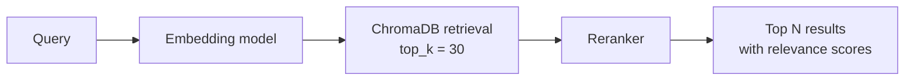
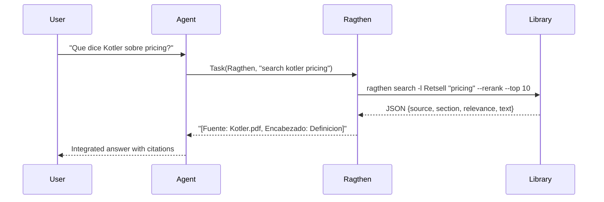
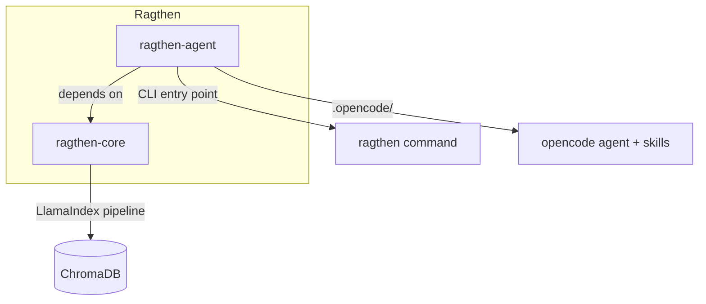

# Ragthen

**Library-first RAG agent for OpenCode.** Index PDFs, EPUBs, TXTs, and MDs into queryable ChromaDB libraries using LlamaIndex. Ships as a `mode: all` agent — switch to it with Tab or invoke it from any agent via `@Ragthen`.

```mermaid
flowchart LR
    A[PDFs / EPUBs / TXTs / MDs] -->|ragthen ingest| B[LlamaIndex Pipeline]
    B -->|SentenceSplitter + Embed| C[(ChromaDB)]
    D[User or Agent] -->|"@Ragthen search"| E[Ragthen Agent]
    E -->|semantic search + rerank| C
    C -->|JSON context| E
    E -->|cited answer [Fuente, Encabezado]| D
```

---

## Why Ragthen?

| Problem | Ragthen's solution |
|---------|-------------------|
| LLMs answer from training data, not your documents | Ragthen ONLY uses your indexed library. Zero external knowledge. |
| Agents mix "thinking" and "researching" in one prompt | Ragthen is a dedicated read-only researcher with clean SOC. |
| Citations are vague or nonexistent | Every claim gets `[Fuente: filename, Encabezado: "Section Title"]`. |
| Low-relevance results get silently used | Ragthen warns you and offers interactive fallback. |
| PDF extraction is poor (no OCR, broken encoding) | Optional cloud parsing via LlamaParse with full OCR and layout awareness. |

---

## Features

### Smart PDF Parsing — Three Modes

| Mode | Flag | What it does |
|------|------|-------------|
| Auto | `--pdfparser auto` (default) | Usa LlamaParse cloud si hay API key, fallback a pypdf local si no. |
| Local | `--pdfparser local` | Solo pypdf (local, gratuito, sin OCR). |
| Cloud | `--pdfparser cloud` | Solo LlamaParse (requiere `LLAMA_CLOUD_API_KEY`). |

Auto mode detects API key automatically from `.env` or environment variables.
If cloud parsing fails or exceeds free tier credits, falls back silently to local.

### Semantic Chunking

Two strategies available:

| Strategy | Flag | Behavior |
|----------|------|----------|
| Sentence | `--chunking sentence` (default) | SentenceSplitter: respeta oraciones y corta por tokens. |
| Semantic | `--chunking sentence+semantic` | Agrupa por similitud semantica antes de dividir. |

### Section-Based Citations

Each chunk is enriched with the nearest Markdown heading as `section` metadata.
Results include:

```json
{
  "source": "Newman - Networks.pdf",
  "page": 0,
  "relevance": 0.5451,
  "text": "...",
  "section": "Chapter 1: Introduction"
}
```

Citations use `[Fuente: filename, Encabezado: "Section Title"]`.

### Configurable Embeddings

| Backend | Example | Max tokens |
|---------|---------|------------|
| HuggingFace (default) | `all-MiniLM-L6-v2` | 256 |
| OpenAI | `text-embedding-3-small` | 8192 |
| OpenAI | `text-embedding-3-large` | 8192 |

Configure via `embedding_model` in config.json.

### Semantic Search with Reranking

Two-phase retrieval:



Reranker options: `cross-encoder` (default), `llm`, `reorder`, `none`.

### Interactive Fallback

When results are sparse or low-relevance, Ragthen doesn't guess — it asks:

- "Intentar con terminos mas amplios"
- "Ver el estado de la libreria"
- "Buscar en otra libreria"

### Cross-Library Analysis

```bash
ragthen search -l Retsell "pricing" --rerank --top 10
ragthen search -l Finsight "pricing" --rerank --top 10
```

Results are synthesized with clear source separation and section citations.

### OpenCode Agent (Mode: all)



Permissions are locked down:

| Permission | Value | Why |
|-----------|-------|-----|
| `bash: "ragthen *"` | allow | All library ops via CLI |
| `read` | allow | Inspect library files |
| `edit` | deny | Ragthen researches, caller writes |
| `webfetch` / `websearch` | deny | Library-only knowledge |

---

## Monorepo Structure



| Package | Purpose |
|---------|---------|
| `ragthen-core/` | RAG engine: LlamaIndex pipeline, ChromaDB, chunking, embeddings, reranking |
| `ragthen-agent/` | CLI, backends (local/remote), OpenCode agent definition, skills |
| `ragthen-content/` | Library structure docs and sync scripts |

---

## Quick Start

```powershell
# 1. Clone and install
git clone https://github.com/BrunoEdPerezS/ragthen.git
cd Ragthen
pip install -e ragthen-core
pip install -e ragthen-agent

# 2. Set up API keys (optional, for cloud PDF parsing)
cp .env.example .env
# Edit .env with your LLAMA_CLOUD_API_KEY

# 3. Create a library and add PDFs
New-Item -ItemType Directory -Path "$env:USERPROFILE\.ragthen\libraries\myresearch"
# Copy your PDFs/EPUBs/TXTs/MDs into that folder

# 4. Index and search
ragthen ingest -l myresearch
ragthen search -l myresearch "your question" --rerank --top 10
```

---

## Commands

| Command | Description |
|---------|-------------|
| `ragthen libraries` | List all libraries and index status |
| `ragthen search -l NAME "query" --rerank --top N` | Semantic search with reranking |
| `ragthen search -l NAME "query" --reranker llm --top N` | Search with LLM reranker |
| `ragthen status -l NAME` | Show indexed documents and chunk count |
| `ragthen ingest -l NAME` | Index all files (auto mode: cloud if key avail, local if not) |
| `ragthen ingest -l NAME --pdfparser local` | Force local parsing (pypdf) |
| `ragthen ingest -l NAME --pdfparser cloud` | Force cloud parsing (LlamaParse) |
| `ragthen ingest -l NAME --chunking sentence+semantic` | Enable semantic chunking |
| `ragthen clear -l NAME` | Delete the library index |
| `ragthen vault ingest -l NAME --vault PATH` | Index Obsidian vault notes |
| `ragthen config` | Show current configuration |

---

## Configuration

Edit `~/.ragthen/config.json`:

```json
{
  "backend_mode": "local",
  "libraries_path": "~/.ragthen/libraries",
  "vault_path": "",
  "chunk_size": 1024,
  "chunk_overlap": 200,
  "llm_model": "gpt-4o",
  "pdfparser": "auto",
  "embedding_model": "huggingface:sentence-transformers/all-MiniLM-L6-v2",
  "chunking_strategy": "sentence",
  "reranker": {
    "type": "cross-encoder",
    "top_n": 10
  }
}
```

API keys via `.env` file (repo root or `~/.ragthen/.env`):

```env
LLAMA_CLOUD_API_KEY=llx-...
OPENAI_API_KEY=sk-...
```

---

## Architecture

```
ragthen-agent/                    raghten-core/
  cli.py                            llama_engine.py (LlamaIndex wrapper)
  backends/                         ├── PDFReader (pypdf) — local
    └── local.py                    ├── LlamaParse — cloud (optional)
    └── remote.py (future)          ├── SentenceSplitter / SemanticChunker
                                    ├── ChromaVectorStore
  .opencode/                        ├── RetrieverQueryEngine + Rerankers
    └── agents/Ragthen.md           └── config.py
    └── skills/analisis-multifuente
```

---

## Metrics

Run the metrics suite to evaluate extraction quality:

```bash
python test/generate_metrics.py
```

Generates `metrics/ragthen_metrics.xlsx` with per-document stats:
chunks, character count, section coverage, FFFD rate.

---

## Future Work

- [ ] **Server mode** — FastAPI + MCP server for remote access
- [ ] **LlamaParse equation extraction** — proper LaTeX for mathematical content
- [ ] **PDF OCR local** — PaddleOCR integration for offline scanned PDFs
- [ ] **More embedding models** — OpenAI, Cohere, multilingual
- [ ] **Hybrid search (BM25 + embeddings)** — keyword + semantic fusion
- [ ] **`ragthen watch`** — file watcher for auto re-indexing
- [ ] **Metadata filtering** — filter by date, author, tags

---

## Design

Separation of concerns, permissions, and architecture decisions are documented
in [ragthen-agent/DESIGN.md](ragthen-agent/DESIGN.md). OpenSpec specs for the
LlamaIndex migration are in [openspec/](openspec/).
